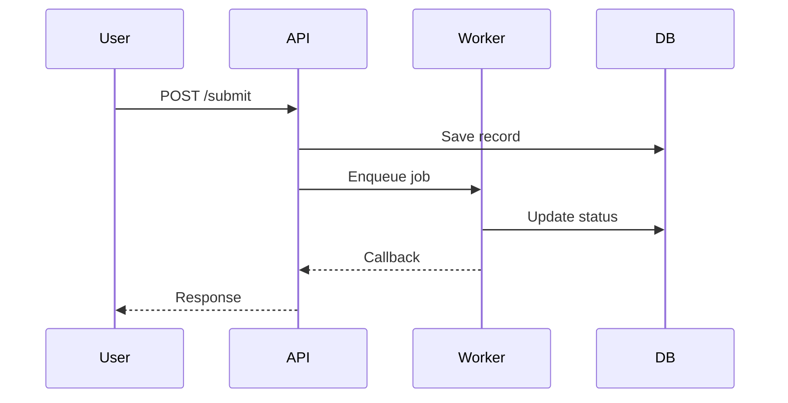

# forge-eng-review — Architecture Review

An engineering manager doesn't let you write code until the plan survives technical scrutiny. This skill does the same: forces hidden assumptions into the open, traces data flow, maps edge cases, and produces a test plan.

## Why This Matters

Plans look solid until you trace the data flow and realize the auth token doesn't propagate to the background worker. Or that the "simple" cache invalidation has four race conditions. Or that nobody specified what happens when the API returns a 429.

This review catches those problems before they become bugs. The cost of finding them now: a few minutes. The cost of finding them in production: days.

## Review Process

### Step 1: Architecture Assessment

Read the plan. For each component, evaluate:

- **Component boundaries:** Are responsibilities clear? Does each module do one thing?
- **Dependency graph:** What depends on what? Where's the coupling? Draw an ASCII dependency diagram.
- **Data flow:** Trace the critical path. Input → transform → store → output. Where does data get lost, duplicated, or stale?
- **Scaling:** What's the bottleneck? Single point of failure? N+1 query hiding in the plan?

Produce an ASCII architecture diagram. If the plan doesn't warrant one (trivial change), say so and skip.

### Step 2: Data Flow Diagram

For the primary user flow, draw the data path:

```
User Request → [Router] → [Controller] → [Service] → [Repository] → [Database]
                      ↓              ↓
                   [Auth]        [Cache]
                      ↓              ↓
                  [401 if fail]  [Hit/Miss]
```

Annotate:
- Where errors can occur (network, auth, validation, DB)
- Where data transforms (serialization, mapping, sanitization)
- Where state changes (side effects, external calls)
- Where caching happens (and what invalidates it)

Every arrow is a potential failure point. Every junction is a potential race condition.

### Step 3: Edge Case Analysis

For each component, list edge cases:

| Component | Happy Path | Edge Cases |
|-----------|-----------|------------|
| Payment processing | Card charged | Card declined, timeout, duplicate charge, currency mismatch, partial refund |
| User search | Results returned | Empty query, special characters, no results, 10K+ results, rate limited |

Cover at minimum:
- Empty input / zero results
- Maximum input / overflow
- Concurrent access (two users doing the same thing)
- Timeout / network failure at each external boundary
- Invalid state (deleted resource, expired token, corrupted data)

### Step 4: Test Plan

Map every code path to a test. For each component:

```
src/services/billing.ts
├── processPayment()
│   ├── [TESTED] Happy path — billing.test.ts:42
│   ├── [GAP] Card declined — NO TEST
│   └── [GAP] Timeout — NO TEST
├── refundPayment()
│   ├── [TESTED] Full refund — billing.test.ts:89
│   └── [TESTED] Partial refund — billing.test.ts:101
```

Mark each path:
- **[TESTED]** — existing test covers it
- **[GAP]** — no test, needs one
- **[REGRESSION]** — existing behavior being changed, test is critical

Quality ratings:
- **★★★** Tests behavior with edge cases AND error paths
- **★★** Tests correct behavior, happy path only
- **★** Smoke test (checks existence, not behavior)

For E2E-worthy flows (auth, payments, multi-step user journeys), mark `[→E2E]`.

### Step 5: Mermaid Diagrams

For complex flows, produce Mermaid diagrams in the plan:



Use sequence diagrams for request flows, state diagrams for state machines, flowcharts for decision trees.

### Step 6: Failure Mode Analysis

For each new code path, describe one realistic production failure:

```
Path: processPayment()
Failure: Payment gateway returns 503 during peak hours
Test exists? No
Error handling? Generic catch, no retry
User sees? "Something went wrong" with no retry option
→ CRITICAL GAP: No retry logic, no graceful degradation
```

Any failure with no test AND no error handling AND a silent user experience is a **critical gap**.

## Completion

Update the plan with:
- Architecture diagram (if warranted)
- Data flow diagram
- Edge case table
- Test coverage diagram with gaps marked
- Mermaid diagrams for complex flows
- Failure mode analysis with critical gaps flagged

Append a `## Eng Review` section to the design doc summarizing findings.

Status: DONE when all sections are complete and critical gaps are addressed. DONE_WITH_CONCERNS if gaps remain but user chose to proceed. BLOCKED if plan is too vague to review.
